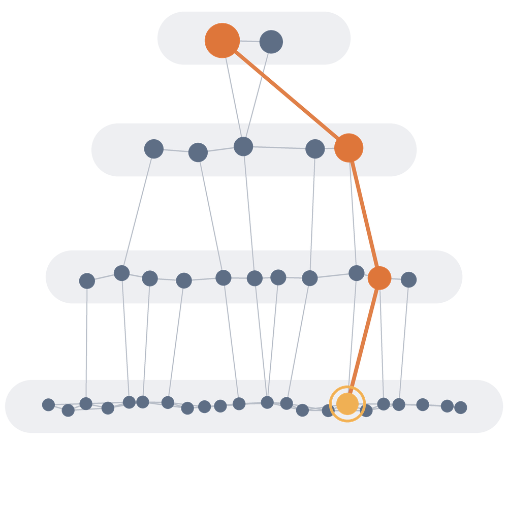

<div align="center">
  

  <h1>hnsw</h1>
  <p><strong>Hierarchical Navigable Small World graphs for fast approximate nearest neighbor search</strong></p>

  <p><em>A <code>no_std</code>-compatible HNSW implementation in pure Rust, extended with in-traversal filtered search, incremental soft delete, runtime-selectable graph degree, and pluggable feature storage. Built for long-lived, incrementally-updated indexes — the case where deletions accumulate and a metadata filter has to be applied without collapsing recall.</em></p>

[](Cargo.toml)
[](LICENSE)
[](https://docs.rs/hnsw/)
[](ensure_no_std/)

**Tech Stack:**
[](https://docs.rs/space/)
[](Cargo.toml)
[](https://docs.rs/hashbrown/)
[](https://docs.rs/libm/)

**Capabilities:**
[](#filtered-search)
[](#soft-delete)
[](#two-index-flavors)
[](#pluggable-feature-storage)
[](#tuning-the-hierarchy)
[](Cargo.toml)
</div>

---

## What is hnsw?

A Hierarchical Navigable Small World graph is an approximate nearest neighbor
index: a stack of graph layers, sparse at the top and dense at the bottom. A
search enters at the top, greedily descends toward the query, and finishes with a
beam search across the bottom layer. That is the picture in the logo, and it is
what makes queries sublinear.

This crate is a fork of [`rust-cv/hnsw`](https://github.com/rust-cv/hnsw)
(at `8d37b6b`), kept `no_std`-compatible and extended for the cases the original
did not cover: filtering during traversal, deleting without rebuilding, choosing
graph degree at runtime, and keeping the feature vectors outside the heap.

```rust
use hnsw::{Hnsw, Searcher};
use rand_pcg::Pcg64;
use space::Neighbor;

let mut searcher = Searcher::default();
let mut hnsw: Hnsw<Euclidean, Vec<f32>, Pcg64, 12, 24> = Hnsw::new(Euclidean);

for feature in &features {
    hnsw.insert(feature.clone(), &mut searcher);
}

let mut neighbors = [Neighbor { index: !0, distance: !0 }; 8];
let found = hnsw.nearest(&query, 24, &mut searcher, &mut neighbors);
```

## What this fork adds

### Filtered search

`nearest_filtered` applies a predicate **during** traversal rather than
over-fetching an unfiltered ranking and discarding the misses afterwards:

```rust
let live = |id: usize| !tombstoned.contains(&id);
let found = hnsw.nearest_filtered(&query, ef, &mut searcher, &mut dest, &live);
```

Only matching nodes enter the bounded result heap; rejected nodes remain eligible
as navigation intermediates, so matches sitting behind them are still reachable.
This matters because the usual workaround — fetch `k * 10`, then filter — silently
returns fewer than `k` whenever the matches fall outside that prefix, which is the
normal case for a metadata filter uncorrelated with distance.

The zero-layer frontier for this path is a binary min-heap expanded nearest-first
with hnswlib's early stop. That is a distance/beam bound, not a hard work bound:
work still scales roughly as `ef / selectivity`, which is inherent to filtered ANN.
Removing the early stop was measured at over 100% of the corpus visited — worse
than a brute-force scan.

### Soft delete

`mark_delete` removes a node from results while leaving its slot and edges in
place, so navigation stays connected until a compaction rebuild:

```rust
hnsw.mark_delete(id);
assert!(hnsw.is_deleted(id));
let live = hnsw.live_count();
```

Tombstones are excluded from the result heap during traversal rather than
filtered out afterwards, so a deleted node cannot consume one of the `ef` result
slots. Tombstones are `#[serde(skip)]` — deliberately, since they are derived
state — so an owner that persists deletions must re-apply them on load.

### Two index flavors

`Hnsw<Met, T, R, M, M0, S>` fixes the graph degree at compile time.
`HnswRuntime<Met, T, R, S>` takes `M` and `M0` as runtime values, for callers that
choose degree from data. The two are kept behaviourally identical, and a test
asserts they agree byte for byte.

### Pluggable feature storage

The `FeatureStore` trait decouples the graph from where feature vectors live —
`Vec<T>` by default, or an `mmap`ed region so the corpus never lands on the heap.
The contract requires stable references: the diversity heuristic holds three
feature references simultaneously while pruning, so a backing that decodes into a
shared scratch buffer would alias them and silently collapse neighbor selection
into nearest-M truncation.

### Tuning the hierarchy

`Params::level_scale` scales the level distribution, so the hierarchy can be
flattened without touching connectivity. Defaults to `1.0`, which reproduces the
original distribution exactly. The idea is from hnswlib-rs's
`Hnsw::modify_level_scale`, reimplemented against this crate's `Params`.

## Tips

A good default for M and M0 is 12 and 24 respectively. Per the paper, M0 should
be double M, but both can be changed freely.

Enable the `serde1` feature to serialize and deserialize an index.

Refer to the [`space` documentation](https://docs.rs/space/) for the distance
traits and types. It also contains `Bits128`–`Bits4096` tuple structs that wrap
byte arrays and enable SIMD; the benchmarks use those.

The euclidean implementation in the tests may accumulate numerical error and fail
the triangle inequality at high dimensionality — use a
[Kahan sum](https://en.wikipedia.org/wiki/Kahan_summation_algorithm) for real
usage.

## Examples

`tests/simple.rs` for euclidean space, `tests/simple_discrete.rs` for hamming
space, `tests/filtered_search.rs` for predicate-filtered queries, and
`tests/incremental_delete.rs` for soft delete.

## Implementation

Based on ["Efficient and robust approximate nearest neighbor search using
Hierarchical Navigable Small World graphs"](https://arxiv.org/pdf/1603.09320.pdf)
by Yu. A. Malkov and D. A. Yashunin, which builds on the
[original NSW paper](http://www.iiis.org/CDs2011/CD2011IDI/ICTA_2011/PapersPdf/CT175ON.pdf).
There are multiple papers by the authors on NSW preceding HNSW.

For more on parameters and implementation details, see
[`implementation.md`](./implementation.md). For benchmarks and how to run them,
see [`benchmarks.md`](./benchmarks.md).

## Provenance

This is a fork of [`rust-cv/hnsw`](https://github.com/rust-cv/hnsw) at commit
`8d37b6b`, by Geordon Worley and contributors, under the MIT license. The core
graph construction and search are theirs; the additions above are not.

### Original upstream credit

The following statement is from the upstream README and is preserved verbatim. It
describes the provenance of the **original** implementation this fork is built on,
and is reproduced unchanged because it is an authorship statement rather than
documentation:

> This is in no way a direct copy or reimplementation of
> [the original implementation](https://github.com/nmslib/hnswlib/blob/master/hnswlib/hnswalg.h).
> This was made purely based on [the paper](https://arxiv.org/pdf/1603.09320.pdf)
> without reference to the original headers. The paper is very well written and
> easy to understand, with some minor exceptions. Thank you to the authors for
> your valuable contribution.

To be explicit about scope: that statement covers the upstream crate. Some
additions in this fork **do** deliberately follow behavior established by
[nmslib/hnswlib](https://github.com/nmslib/hnswlib) and
[jean-pierreBoth/hnswlib-rs](https://github.com/jean-pierreBoth/hnswlib-rs) —
specifically the filtered-search admission and early-stop semantics, and the
level-scale knob — reimplemented from their described behavior rather than copied.
Both are MIT/Apache-2.0 licensed.

## License

MIT, as inherited from the upstream project.
